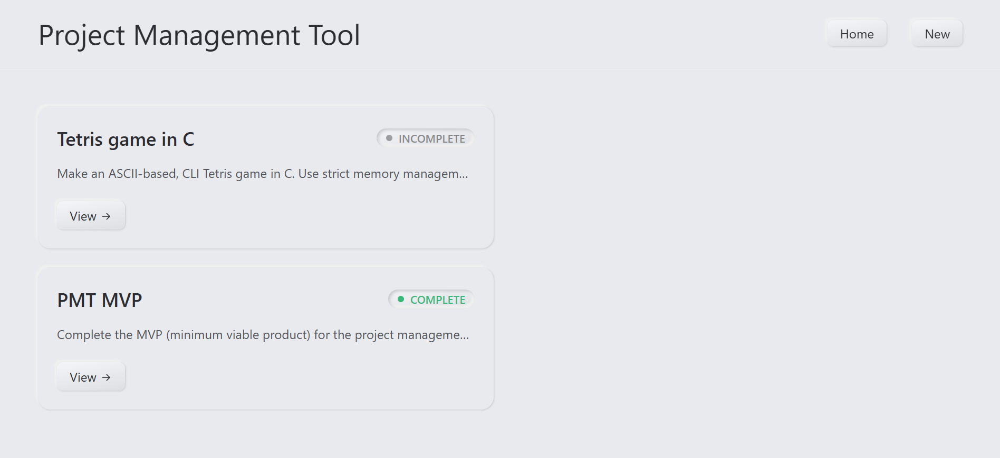
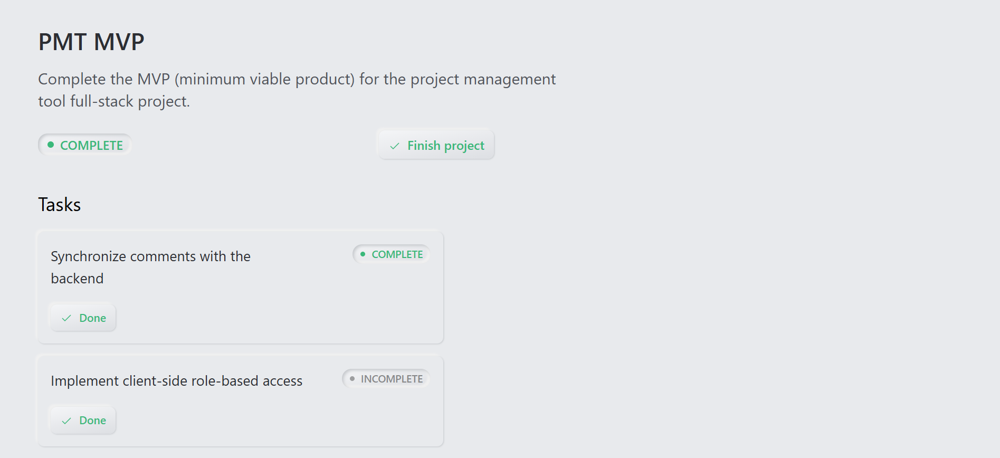
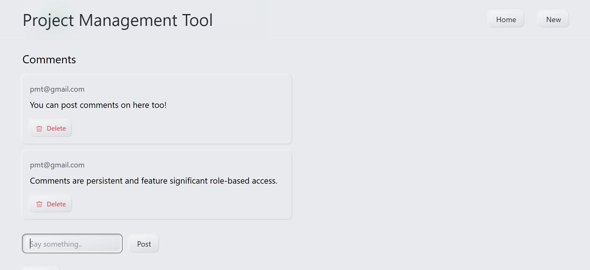

# Project Management Tool (MVP)

### Home page



### Project page



### Comment section



### Description

A full-stack project management tool built with the PERN stack. So far, this project is the one that best represents my skill in web development. I look forward to improving this project further.

Features:
1. Project management: easily create and manage multiple projects and tasks
2. Commenting: freely comment on a project that you have access to
3. Role-based access: privileges differ depending on role in the project
4. User invitation: invite teammates and other users to help with your project 

## Table of Contents

1. [Installation](#installation)
2. [Usage](#usage)
3. [Tech Stack](#tech-stack)
4. [Other](#other)
5. [Demo (coming soon)](#demo)
6. [License](#license)

## Installation

```
git clone https://github.com/logicalPanda2/project-management-tool.git
```

## Usage

### Configuring the database

1. Start the Postgres server through services.msc
2. (OPTIONAL) create a dedicated user for the project to use
3. Log in to the postgres CLI
4. Create a database for the project and connect to it
5. Copy the absolute path of the migration script `backend/src/db/migrations/001_create_users_and_projects.sql`
6. Run the migration script

### Running the backend

1. Move to the backend directory: `cd ./project-management-tool/backend`
2. Install the dependencies
3. Create a `.env` file inside the root backend directory
4. Write down the information according to .env.example (use `openssl rand -hex 64` in Git Bash for secret keys)
5. Start the backend

### Running the frontend

1. Move to the frontend directory: `cd ./project-management-tool/frontend`
2. Install the dependencies
3. Start the frontend
4. Press `O + Enter` to go to the website
5. Register an account, log in, and start using the app.

## Tech Stack

### Frontend

- React with React Router
- Tailwind CSS
- Motion
- Axios
- TypeScript

### Backend

- Express
- PostgreSQL
- JWT Auth
- TypeScript

## Other

The following will be fixed/implemented as soon as possible.

### Issues to fix

- The access token is the same for every single login session

### Areas of improvement

- DB transactions
- DB query optimization
- Refresh logic for authenticated users
- Backend role middlewares to guard against unauthorized access
- /:projectId/role endpoint
- Stricter role-based access (via 404 redirects) in the client side
- Further component modularization

### Further polish

- Additional transitions with Motion
- Soft deletions with undo
- Confirmation dialogs and undo/completed toasts

## Demo

A live demo with localStorage will be made as soon as possible. Stay tuned!

## License

<a href="./LICENSE.txt">MIT License</a>
